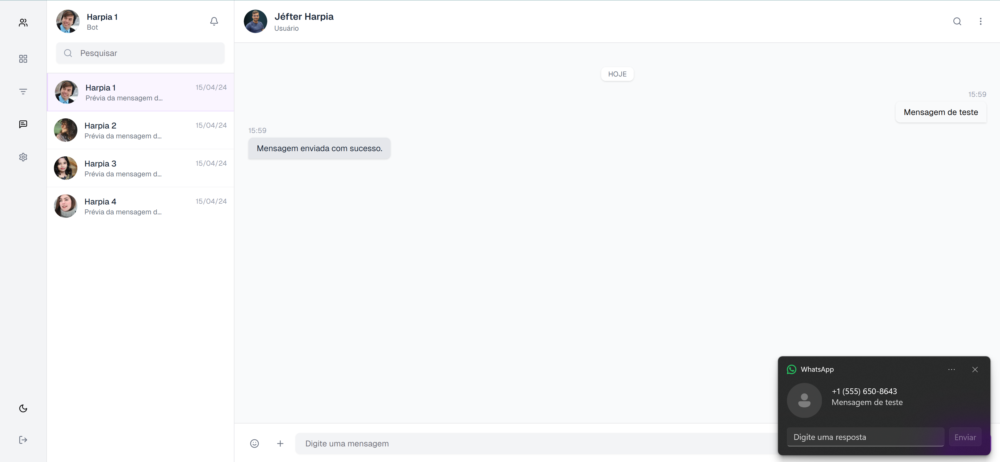
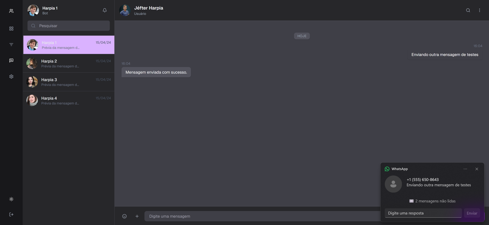

# Harpia Chat Frontend

Interface de chat web desenvolvida em **Next.js** integrada a uma API externa via mensagens [BACKEND]. O projeto permite envio de mensagens para um número de testes configurado na Meta, interface amigável e suporte à versão dark.

## 🛠️ Tecnologias Utilizadas

-   [Next.js 15](https://nextjs.org/)
-   TypeScript
-   Tailwind CSS
-   Shadcn UI (UI components)
-   ESLint + Prettier
-   Integração com API personalizada em [NestJS](https://docs.nestjs.com/) (Backend)

## ⚙️ Variáveis de Ambiente

Crie o arquivo `.env` e adicione as seguintes variáveis:

```env
# URL base da API (backend)
API_BASE_URL=http://localhost:3001

# Número do whatsApp de testes cadastrado na meta
NEXT_PUBLIC_WHATSAPP_PHONE=55999999999
```

## 🚀 Como Rodar

### Instalação

```bash
pnpm install
```

### Ambiente de Desenvolvimento

```bash
pnpm dev
```

A aplicação estará disponível em: [http://localhost:3000](http://localhost:3000/)

### Build de Produção

```bash
pnpm build
pnpm start
```

🖼️ Capturas de Tela





---

**MIT License**

Desenvolvido por [Jéfter](https://github.com/jefter-dev)
